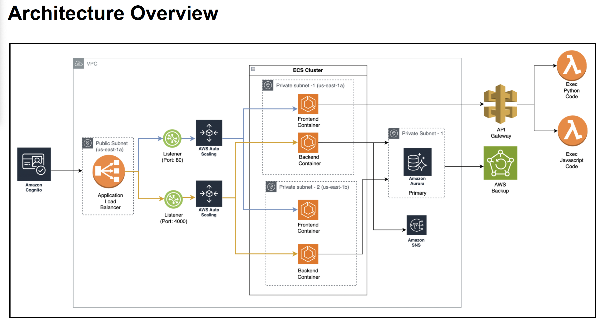
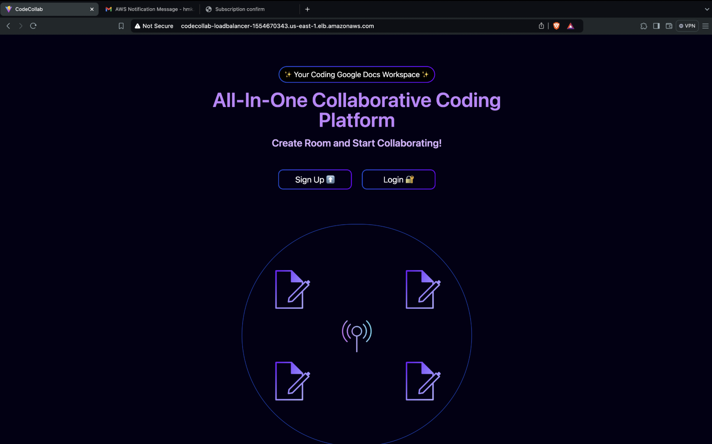
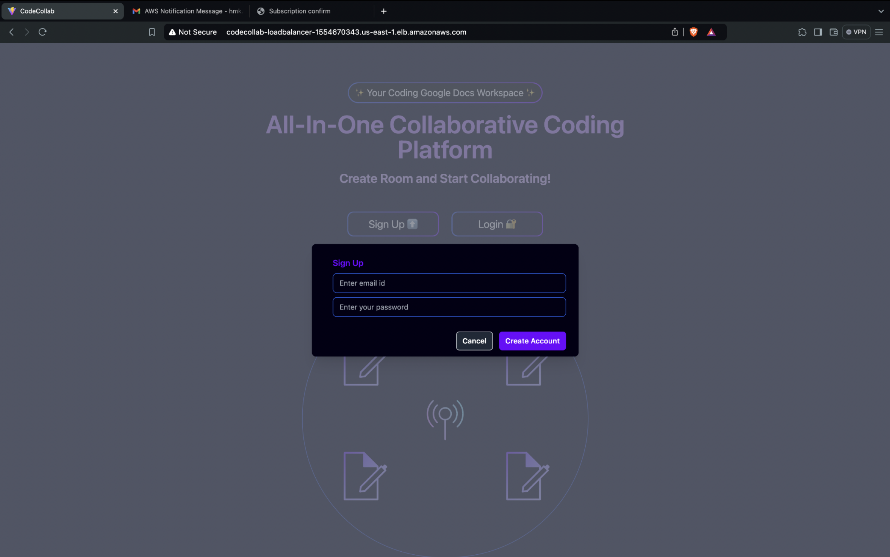
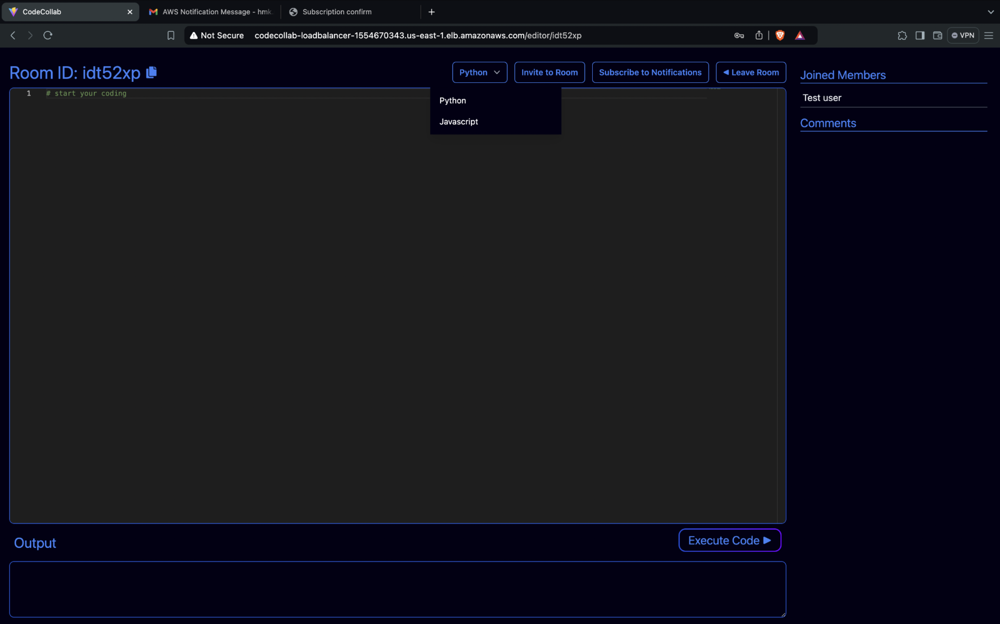
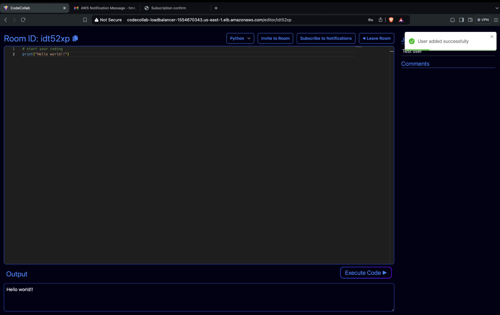
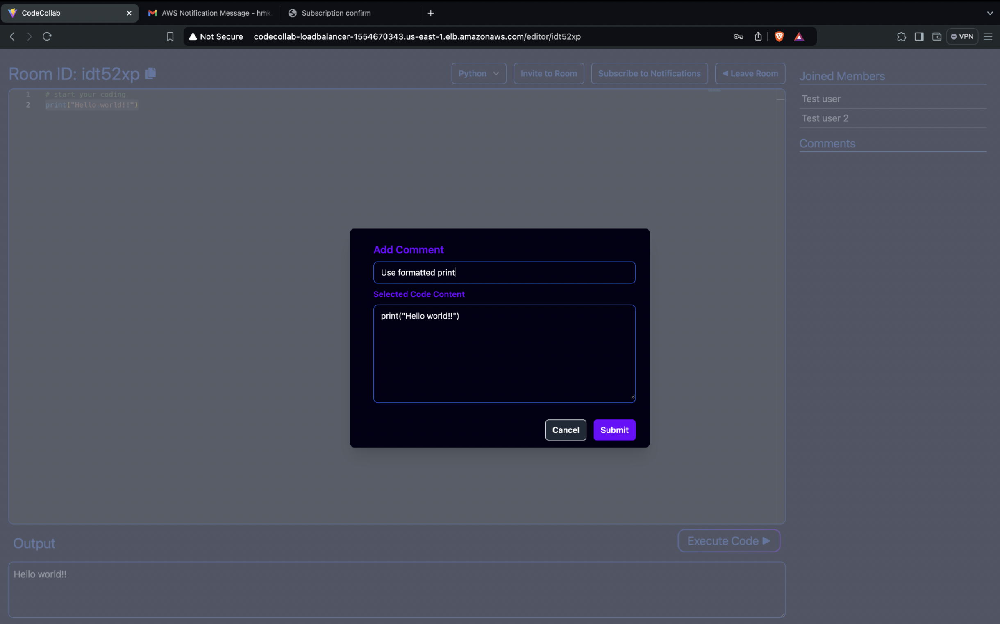

# Code-Collab

Code-Collab is a collaborative coding platform that enables users to create and join coding rooms where members can work together in real-time. The application supports Python and JavaScript code execution, real-time comments, and room notifications via email.
  
## Project Overview
Code-Collab supports real-time collaborative coding, providing tools for users to work on code snippets together. The project architecture follows best practices for cloud applications using AWS services for container orchestration, serverless functions, and database management.

The separation of frontend and backend services allows for flexible deployment and scaling using Amazon Elastic Container Service (ECS) and Elastic Container Registry (ECR). AWS Cognito manages user authentication, while Amazon RDS (Aurora MySQL) ensures data reliability. AWS SNS provides real-time notifications for an enhanced user experience.

## Features
- Real-time coding collaboration
- Room-based structure for coding sessions
- Python and JavaScript code execution support
- User authentication with AWS Cognito
- Real-time notifications for room comments using AWS SNS

## Architecture




This project is built using a microservices architecture and leverages AWS for scalability and security:
- **ECS** hosts frontend and backend services
- **AWS Cognito** handles user authentication
- **RDS (Aurora MySQL)** stores room data, code, and comments
- **API Gateway** facilitates backend access
- **SNS** sends notifications for room comments
- **AWS Lambda** execute room code

The architecture aligns with the AWS Well-Architected Framework, ensuring reliability, security, and scalability.

## Installation

### Prerequisites
- [Node.js](https://nodejs.org/) (>=14.x)
- React
- Tailwindcss
- AWS account for configuring Cognito, RDS, and other services

### Frontend Installation

   ```bash
   cd frontend
   #Install the dependencies
   npm install
   #Start the frontend development server
   npm run dev
   ```
### Backend Installation

 ```bash
   cd backend
   #Install the dependencies
   npm install
   #Start the backend server
   npm start 
   ```
### Environment Variables

#### Frontend
Create a .env file in the frontend directory and add:
```
VITE_SERVER_URL=<Your backend server URL>
VITE_API_GATEWAY_URL=<Your API Gateway URL>
```

#### Backend
Create a .env file in the backend directory and add:
```
DB_HOST_NAME=<Your DB Host>
DB_USER_NAME=<Your DB Username>
DB_PASSWORD=<Your DB Password>
DB_NAME=<Your DB Name>
USER_POOL_ID=<AWS Cognito User Pool ID>
CLIENT_ID=<AWS Cognito Client ID>
ACCESS_KEY_ID=<AWS Access Key ID>
SECRET_ACCESS_KEY=<AWS Secret Access Key>
SESSION_TOKEN=<AWS Session Token>
REGION=<AWS Region, e.g., "us-east-1">
TOPIC_ARN=<AWS SNS Topic ARN>
PORT_NUMBER=<Backend Port Number>
```

## Screeenshots

Landing Page


SignIn/Login


Code Room


Executing code and inviting other users


Adding comments

